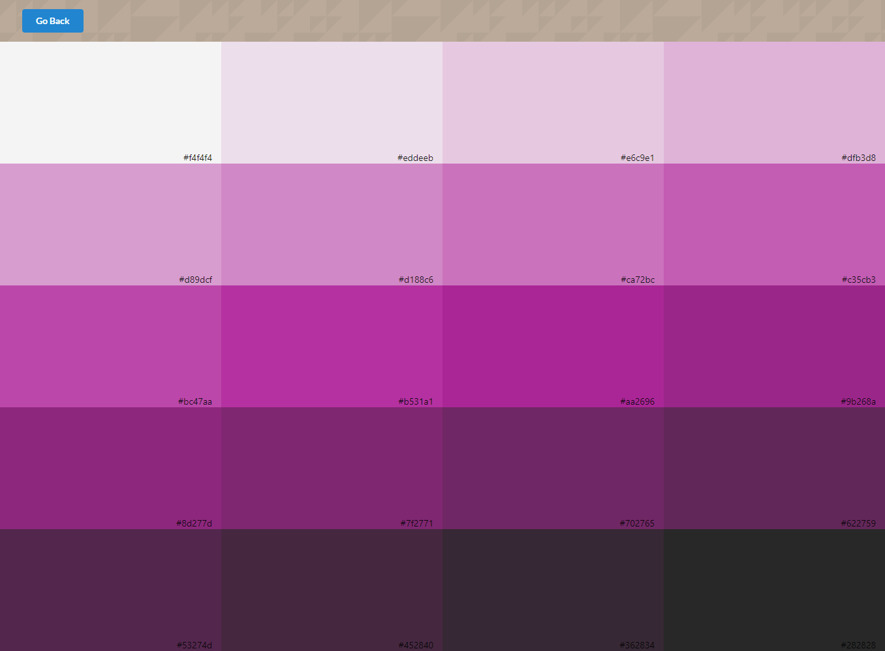

### Color palette application.

## Description

Create a color palette with all of your favorite colors. The application generates twenty shades of every color added in the palette. 

### Home page


### pink-ui palette page


### shades for the bubblegum color in the pink-ui palette



## Built with

- Javascript
- Reactjs
- chroma-js
- firebase

## Live Demo 

[Website link](https://palette-n-shades.com/)

## Getting Started

To get a local copy up and running follow these simple example steps.

## Prerequisites

- Install node.

## Set up

- Clone the project.
- Cd into the project directory.
- Run ```npm install``` to install package.json libraries.
- Run ```npm start``` and view the project on your localhost.


## Author

- Github: [@blackpintz](https://github.com/blackpintz)
- Twitter: [@blackpintz](https://twitter.com/blackpintz)


## 🤝 Contributing

Contributions, issues and feature requests are welcome!

Feel free to check the [issues page](https://github.com/blackpintz/palette-n-shades/issues).

## Show your support

Give a ⭐️ if you like this project!

## Acknowledgments

- [Colt Steele](https://github.com/Colt)

